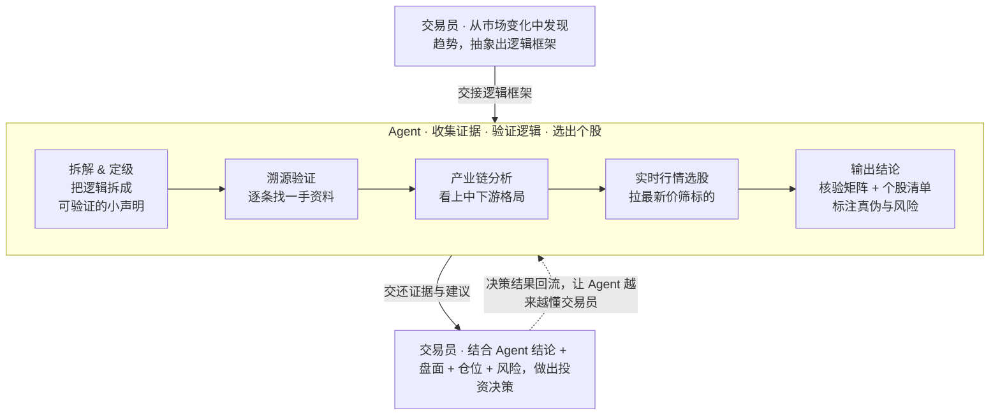

# AlphaLoop — 人机投研协作操作系统

> **一句话**：交易员出方向，Agent 出证据，决策权归人。
>
> 这不是一个干活的 skill，而是一个**编排器（operating model）**。它定义人和 Agent 的分工，并在投研语境里自动调度下面这些子 skill。本文是「总调度」，每个环节的细则在对应子 skill 里。

## 核心理念

人类在市场中真正的 alpha，是**从变化中嗅出趋势、把它抽象成可证伪的因果链**——这是 Agent 替代不了的。Agent 的价值在于**不知疲倦地收集证据、逐条验真、取实时行情、落档复利**。所以最优分工不是"让 Agent 替你思考"，而是：

- **人**负责"往哪看"（方向、框架、判断、扣扳机）
- **Agent**负责"看清楚"（验证、取数、选股、记忆）
- **决策权和认知主导权，始终归人**

## 三层分工 + 反馈闭环

## 路由表：什么信号 → 调度哪个子 skill

进入投研语境后，按下表把活分派给对应子 skill（细则点进去看）：

| 信号 / 场景 | 调度的子 skill | 干什么 |
|---|---|---|
| 人给了一段逻辑 / 转发研报 / 小作文 / "别的 AI 说" | [`claim-verification`](skills/claim-verification/SKILL.md) | 默认降级为假设，拆原子声明，逐条溯源到一手，打 ✅🟡🔴⚠️ |
| 提到任何 ticker / 公司 / 行业 / 框架 / 财报 | [`openorder`](skills/openorder/SKILL.md) | **第一动作**先读 wiki `INDEX.md` → 相关档；结论回写 |
| 需要价格 / 估值 / 涨跌幅 / 市值 | [`stock-data-fetch`](skills/stock-data-fetch/SKILL.md) | 取实时行情，标时间 + 源，禁用旧价 |
| 原材料 / 金属 / 矿 / 卡脖子 / 出口管制 / 涨价 | [`strategic-materials`](skills/strategic-materials/SKILL.md) | 五层漏斗：供需→资源掌控→国产替代→AI 关联→政策→标的 |
| 人做了交易 / 发持仓截图 / "记一笔" | [`trade-journal`](skills/trade-journal/SKILL.md) | 记成本 + 建仓日 + **来源框架**，闭合反馈环 |
| 任意工具失败（403/404/抓不到/clone 不动） | [`agent-tool-escalation`](skills/agent-tool-escalation/SKILL.md) | 升级工具而非升级用户；修正已有信息前先验证 |

> `strategic-materials` 本身也是个编排器——它是「人交给 Agent 的框架」的最佳范例，演示了一个领域框架如何强制接线验真 + 行情 + 落档。想给自己的领域写框架，照它的样子来。

## 三条铁律（Agent 必须守）

这三条是这套模式的纪律核心，没有它们，整个闭环会退化成"换皮的复读机"。

1. **人给的框架默认降级为假设（C 级）**。不管听起来多合理、不管是不是用户亲口说的、不管别的 AI 是否也这么说——**plausible ≠ correct**。先拆条、先验真，再决定采信。详见 `claim-verification`。

2. **行情必须现取，标时间 + 源**。任何选股 / 估值 / 涨跌幅 / 对比，开口前先用 `stock-data-fetch` 拉最新价，禁用训练数据里的旧价。输出形如「NVDA \$211.5（Finnhub, 2026-05-08 16:32 UTC+8）」。

3. **结论必须回写 openorder**。验证完的结论不是一次性消耗品——回写 `companies/*.md` + `log.md` + `INDEX.md`，让 edge 跨会话复利。读了不写 = 白做。

## 人机边界（不可僭越）

- Agent 给的是 **input**，不是 **trigger**。**仓位、风险敞口、择时、是否扣扳机**永远在交易员手里。
- Agent 必须主动提示**反方观点和风险**，但不替用户承担"该不该买、买多少"。
- 交还给交易员的标准产物：**核验矩阵 + 个股清单 + 证据链 + 明确标注的不确定性 + 一句话落点**。

## Worked Example（真实案例走查）

> 完整脱敏走查见 [`docs/case-study.md`](docs/case-study.md)。这里给骨架，演示一次完整闭环。

**1. 人出框架**：交易员转来一篇文章 +某 AI 的结论，抽象出因果链——"中日关系恶化 → 中国收紧中重稀土出口管制 → 卡日本半导体/MLCC 原料 → 镝/钇/锆『三神材』受益，附一串受益标的"。

**2. Agent 验证执行**（逐条对应流程图 5 步）：
- *拆解 & 定级*：把文章降级为 C 级假设，拆出「镝/钇是 MLCC 掺杂剂」「中国管制了镝/钇」「氧化锆是稀土」「涨价 140 倍」等原子声明。
- *溯源验证*：用一手源（管制清单、Argus/路透报价）核到「140 倍是真的，但那是**海外价**，国内只涨 70% 量级」。
- *产业链分析*：套 `strategic-materials` 五层漏斗，揪出关键失真——文章把「氧化锆」当稀土，其实它是搭便车的国产替代腿，和镝/钇的反制逻辑是两条腿。
- *实时行情选股*：用 `stock-data-fetch` 拉最新收盘价，看资源端集体涨停，并校正个股代码、补漏遗漏标的。
- *输出结论*：出核验矩阵打 ✅🔴 标签 + 标的分档，回写 openorder wiki。

**3. 交还人决策**：一句话落点——"要买先想清楚买哪条腿：反制叙事看重稀土，国产替代看锆粉；那 140 倍是海外超高纯价，国内矿企吃不到这个价差。" 扳机留给交易员。

> 这个案例的价值：人给的框架**骨架是真的**，但 Agent 溯源后揪出两处失真——若不验证直接采信，选股方向就会偏。这正是三条铁律的意义。

## 结束前自检清单

任何投研对话收尾前过一遍：

- [ ] 我有没有把人给的框架**当假设**来验，而不是直接采信？
- [ ] 涉及的关键数字都**溯源到一手**了吗？无源的标 ⚠️ 了吗？
- [ ] 价格是**现取**的吗（标了时间 + 源）？
- [ ] 我读 openorder `INDEX.md` 了吗？结论**回写**了吗？
- [ ] 我有没有越界替用户做决策？是否给了风险 + 反方观点？
- [ ] 有交易发生的话，`trade-journal` 记了**来源框架**吗？

任一为"否但应为是" → 现在补做。

## 这套 skill 不做什么

- ❌ 不替用户决策、不给买卖扳机——只给证据和风险。
- ❌ 不因为"听起来合理"就采信任何二手信息。
- ❌ 不用旧价说事，不照搬研报数字当事实。
- ❌ 不含任何私有数据：本仓库只发方法论 + 模板，你的 wiki 内容 / 持仓 / API key 都留在你自己机器上。

## 子 skill 索引

| 层 | skill | 角色 |
|---|---|---|
| 纪律 | [`claim-verification`](skills/claim-verification/SKILL.md) | 二手信息验真方法论 |
| 工具纪律 | [`agent-tool-escalation`](skills/agent-tool-escalation/SKILL.md) | 工具失败升级 + 修正门槛 |
| 记忆 | [`openorder`](skills/openorder/SKILL.md) | 跨会话投研 wiki（回写 + thesis-ledger） |
| 示例框架 | [`strategic-materials`](skills/strategic-materials/SKILL.md) | 战略原材料五层漏斗（领域框架范例） |
| 行情工具 | [`stock-data-fetch`](skills/stock-data-fetch/SKILL.md) | 多市场实时行情（免 key 兜底） |
| 反馈闭环 | [`trade-journal`](skills/trade-journal/SKILL.md) | 建仓即记 + 来源框架归因 |

License: MIT。详见 [`LICENSE`](LICENSE)。
