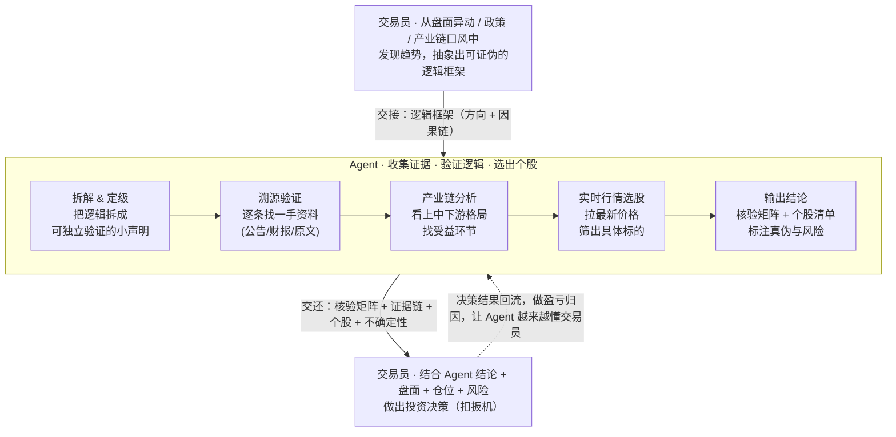

# 工作流详解：三层分工 + 反馈闭环

本文把 AlphaLoop 的协作模式讲透：每个环节用什么能力、交接什么、边界在哪。如果你只想看一句话总结——**交易员出方向，Agent 出证据，决策权归人**。

## 完整流程图

## 第一层 · 交易员：发现与抽象

这一层是人类无法被替代的 alpha。交易员从市场变化中**嗅出趋势**，并把它抽象成一条**可证伪的因果链**——一个明确指向传导路径和受益方向的逻辑框架。

- 交接给 Agent 的应该是**假设**而非结论。例如："我认为 AI 数据中心计划会沿『电力 → 液冷 → 光模块』传导，受益顺序如此。"
- 关键：人给的是**方向和因果链**，不是让 Agent 替你定方向。

## 第二层 · Agent：收集、验证、落地

Agent 默认把交易员的框架**降级为待验证假设**，依次完成五个动作（对应流程图里的 B1–B5），每步调度一个子 skill：

| 步骤 | 干什么 | 调度的子 skill |
|---|---|---|
| 拆解 & 定级 | 把框架拆成可独立验真的原子声明，标出哪条最关键 | `claim-verification` |
| 溯源验证 | 每条声明都去找一手出处（公告/财报/原始信源），拒绝二手转述 | `claim-verification` + `agent-tool-escalation`（抓不到时升级工具）|
| 产业链分析 | 涉及大宗/原材料时，套五层漏斗研判上中下游格局 | `strategic-materials` |
| 实时行情选股 | 拉最新价格，从产业链里筛出具体标的 | `stock-data-fetch` |
| 输出结论 | 逐条打 ✅🟡🔴⚠️，汇总核验矩阵 + 个股清单，并回写知识库 | `openorder` |

为什么"先读 wiki 再开口"：避免重复劳动，并用历史结论校准新框架——也许知识库里早有反例或更新过的数据。

## 第三层 · 交易员：决策

- Agent 给的是 **input**，不是 **trigger**。**仓位、风险敞口、择时、是否扣扳机**永远在人手里。
- Agent 主动提示风险和反方观点，但不替人承担"该不该买、买多少"。

## 反馈闭环（系统复利的关键）

决策之后的结果（对了/错了/为什么）回流给 Agent：

1. 用 `trade-journal` 记下这笔交易的**来源框架**（哪个逻辑/thesis 驱动的）。
2. 在 `openorder` 的 thesis-ledger 里做**盈亏归因**——但记分的是框架**命中率**，不是单笔盈亏。
3. 下次遇到同类逻辑框架，Agent 能提示"这类假设你历史上容易高估/低估"。

这条线一开始是断的，需要交易员决策后把结果丢回来才能接上。接上之后，第二层会越来越懂第一层。

## 三条铁律（再强调一次）

1. 人给的框架默认降级为假设（C 级）—— `plausible ≠ correct`。
2. 行情必须现取，标时间 + 源。
3. 结论必须回写 openorder，让 edge 跨会话复利。

整套机制的核心：**人负责方向与判断，机器负责证据与执行，决策权与认知主导权始终归人。**
